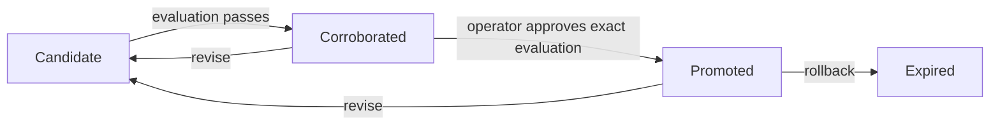

# Evaluated procedures

`ProcedureBook` turns a complete, evidence-backed method into a reusable local
procedure after a registered holdout evaluation and operator approval. Proposing,
reading, importing, and promoting a method never execute its steps. Execution
happens only when trusted local code explicitly calls `evaluate` with a runner
registered by that host.

The lifecycle is append-only:



A failed evaluation retains its observations and leaves the method a candidate.
Revision starts a new candidate and invalidates prior evaluations. Rollback
withdraws the active method while preserving every original revision, failed
case, evaluation, and approval.

## Register the local evaluation

A host supplies an `ExperimentRunner`, the existing Reason interface whose
`run(Hypothesis)` returns a bound `Outcome`. The registry contains actual local
runner objects. Evaluator names in memory or imported metadata cannot load code
or register runners.

```python
from cairntir.procedures import (
    EvaluationManifest, HoldoutCase, ProcedureBook, ProcedureSpec,
    RegisteredEvaluation,
)

manifest = EvaluationManifest(
    evaluator_id="local-cache-check/v1",
    baseline_steps=("Keep the current cache policy.",),
    cases=(
        HoldoutCase("update-existing", update_case_id, "fresh response"),
        HoldoutCase("delete-existing", deletion_case_id, "missing response"),
    ),
    threshold=0.5,
)

def approve(request):
    print(request.title, request.revision_sha256, request.evaluation_sha256)
    return input("Approve this exact revision and evaluation? Type APPROVE: ") == "APPROVE"

book = ProcedureBook(
    store,
    evaluations={
        manifest.evaluator_id: RegisteredEvaluation(manifest, trusted_cache_runner),
    },
    operator_approval=approve,
)
```

Here `store`, the evidence IDs, and `trusted_cache_runner` are provided by the
embedding application. The runner owns its execution environment and supported
operations; the library does not interpret step strings as Python or shell code.
The approval callback is trusted local startup code and must return the actual
boolean `True`. Approval-looking text, model names, and truthy strings do not
authorize promotion. A scoped caller also needs the separate `approve`
capability, along with the read/write scope needed for the operation.

## Propose, evaluate, and promote

```python
candidate = book.propose(
    wing="cache-project",
    spec=ProcedureSpec(
        title="Invalidate cache entries after a committed mutation",
        prerequisites=("The database commit succeeded.",),
        applicability="Updates and deletions of previously cached records.",
        steps=("Invalidate the affected record key.", "Read through on the next request."),
        expected_outcome="Subsequent reads reflect the committed database state.",
        rollback=("Restore the earlier policy and preserve the observed failure evidence.",),
        evidence_ids=(development_evidence_id, counterexample_id),
        counterexample_ids=(counterexample_id,),
        development_case_ids=("development-update",),
    ),
)
evaluation = book.evaluate(candidate.drawer_id, evaluator_id=manifest.evaluator_id)
if evaluation.passed:
    promoted = book.promote(evaluation.current_id, evaluation_id=evaluation.drawer_id)
```

Every field of the method contributes to its revision fingerprint. Referenced
evidence must exist in the same wing. Holdout cases must have independent IDs
and content, with no overlap with development evidence. Renaming a development
example does not create an independent holdout.

The supported metric is candidate success rate minus baseline success rate.
Its finite threshold is declared before execution and must be in `(0, 1]`.
Every holdout runs once for the baseline and once for the candidate. The runner
receives a JSON claim binding the method revision, evaluator manifest, case,
variant, steps, and exact input evidence. Its outcome must refer to that same
hypothesis and contain a boolean verdict and nonempty observation.

Each run writes ordinary Reason prediction and observation evidence. Failed
candidate observations remain counterexamples even when the aggregate score
passes. Runner exceptions leave explanatory failure evidence and never
corroborate the method.

## Read and withdraw

```python
active = book.list(wing="cache-project")
all_current = book.list(wing="cache-project", active_only=False)
history = book.history(candidate.drawer_id)
receipt = book.get_evaluation(evaluation.drawer_id)
withdrawn = book.rollback(promoted.drawer_id, reason="A new counterexample invalidates the method.")
```

Procedure and evaluation origin is registered separately from ordinary drawer
metadata. Cloned or imported receipts remain evidence; they cannot become local
approvals or supersede the authenticated lifecycle. Ordinary Discovery methods
cannot transition registered procedures. Authentic procedure revisions still
appear in the Discovery Ledger.

Runner work and operator callbacks run outside the final transaction. Before
committing, the book checks the current authenticated leaf and the exact
revision, evaluator manifest, and evaluation again. A concurrent revision or
withdrawal makes the pending result stale; competing approvals cannot produce
two current promoted leaves. Reopening the store retains authentic history but
does not recreate an operator callback.
