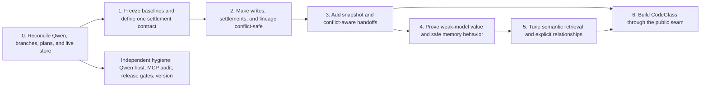

# Cairntir Improvement Plan: Whole, Conflict-Safe, and Proven

**Prepared:** August 4, 2026 (America/New_York)  
**Status:** Proposed, research-backed plan. No implementation is authorized by this document.  
**Inputs:** Current Cairntir code/store state, project drawers, existing plans, three audited transcripts, current primary-source research, and the live multi-agent/Qwen overlap discovered during the research pass.  
**Companion research:** `cairntir-transcript-research-2026-08-04.md`

## The decision in one page

Cairntir should continue to be the **host-neutral continuity and evidence layer** underneath AI work. It should not become an agent runtime, scheduler, GraphRAG system, or autonomous business optimizer.

The next build should pursue three outcomes in this order:

1. **Make shared memory conflict-safe.** Multiple hosts and agents must not be able to create duplicate logical actions, silently fork a history, hide a competing settlement, or act from a stale handoff without Cairntir making that visible.
2. **Prove the North Star.** A weak/free model, given a small number of complete Cairntir memories, must continue interrupted work more correctly per fixed token/time budget than it can without Cairntir.
3. **Restore CodeGlass as the companion learning network.** It should consume Cairntir's public store contract, discover patterns in the Obsidian link network, and remain removable from the memory core.

The implementation sequence is therefore:

Do not commission every phase at once. Approve Phase 0 and the Phase 1 specifications first, then reconsider the rest using the evidence they produce.

## Crucible check on this recommendation

**Known, strong evidence:** the primary checkout changed during planning; Qwen's candidate is isolated on a pushed feature branch; remote and local `main` differ; settlement readers disagree; lineage can hide siblings; direct settlement lacks logical-operation identity; and semantic recall failed in this session.

**Load-bearing assumptions:** memory quality is a major limiter for the chosen weak/free model; the proposed effect thresholds represent useful improvement; and a single integrator can enforce branch ownership. Phase 1 tests the first two before expansion. Phase 0 turns the third into an explicit operating rule.

**Unknown until tested:** whether generic workflow leasing needs a schema change, which local embedder wins on Cairntir's real workload, and whether a memory steward adds value inside a fixed budget. The plan does not commit to any of them.

**Decision:** proceed with reconciliation and specification/evaluation work only. Later phases remain conditional. Abort or redesign any downstream phase whose load-bearing assumption is falsified.

---

# 1. North Star and boundaries

## North Star

Patrick's existing acceptance criterion remains controlling:

> “To keep a solid memory so that EVEN IF I was using FREE AI with terrible output, it could over time follow the pieces to make the whole.”

The operational metric is:

> **Correct future continuations by a weak model per fixed token, time, and money budget.**

Retrieval scores, drawer counts, agent counts, and graph size are diagnostic. None is the product outcome.

## Cairntir owns

- verbatim, append-only memory and provenance;
- structural and semantic retrieval;
- claims, predictions, observations, supersession, and attributed status;
- atomic persistence invariants;
- duplicate-operation detection;
- visible lineage branches and conflicts;
- whole-drawer, budgeted, freshness-aware handoffs;
- host-neutral tool and store contracts;
- empirical calibration and outcome evidence.

## Hosts and Git own

- choosing and running agents;
- worktrees, branches, patches, merges, and deployments;
- permissions and human approval gates;
- selecting business goals and KPIs;
- scheduling and retry policy;
- deciding who is authorized to adjudicate a contested claim.

Cairntir records the evidence and receipt. It does not become the scheduler or permission system.

## CodeGlass owns

- the companion learning-network experience;
- Obsidian link-graph inspection and pattern discovery;
- teaching, walkthrough, and retention views;
- an eventual standalone package after the companion seam and pattern value are proven.

## Explicit non-goals

- No LangGraph, AutoGen, Microsoft Agent Framework, or n8n competitor.
- No GraphRAG or graph database before explicit one-hop relations prove value.
- No automatic semantic merge, last-write-wins, or deletion of near-duplicates.
- No CRDT or distributed-consensus project for a local-first store.
- No in-core agent RBAC, team scheduler, or global work lease manager.
- No SEO, advertising, social-growth, or self-running-business loop.
- No self-selected KPI or self-modifying prompt policy promoted by an LLM grader alone.
- No MCP Sampling foundation; Sampling is deprecated in the current MCP protocol.
- No embedder change against the live store without Patrick present.

---

# 2. Honest starting state

This is the state observed while the plan was written. The primary checkout was actively changing, so Phase 0 must refresh it again before implementation.

## Landed on canonical `main`

The remote canonical branch was at `4483c96` after PR #42 merged. The local `main` ref in the primary checkout was still at `0af5cbb`, so Phase 0 must refresh it deliberately rather than assuming the branch name means the same commit. The following machinery is present:

- structural anchor extraction, repair, and `recall_for_change`;
- first-class validated anchors on `cairntir_remember`;
- vault-sync command and drift gate;
- budgeted, whole-drawer `session_start` and `handoff`;
- claim and predicted-outcome writes;
- append-only `cairntir_settle`;
- handoff display of “open” predictions;
- legacy trust re-attestation;
- caller-declared per-write model provenance;
- write-time content and anchor integrity guard;
- durable workflow receipts and selected idempotent workflows;
- public Store protocol and the existing absorbed CodeGlass foundation.

P0, P1, and P2 are therefore **mechanically implemented**. They are not yet fully proven against their acceptance outcomes.

## Live store snapshot

The read-only audit found:

- schema v6;
- 286 drawers;
- 149 anchored drawers, 52.1% of the full store;
- trust: 126 `agent_generated`, 123 `legacy_migrated`, 36 `user_asserted`, 1 `untrusted`;
- claim / predicted / observed / delta fields populated on 2 / 2 / 1 / 0 drawers;
- no stranded started workflows;
- Qwen's wing-resolution drawer #286, with `model=qwen-code` and an untrusted direct-library receipt.

The original P0 acceptance target used “drawers that reference code” as its denominator, not all drawers. That denominator and the ≥60% proof have not been recomputed honestly. Do not call P0 accepted merely because total coverage reached 52.1%.

## Qwen work and moving-checkout evidence

During planning, the primary checkout first appeared on `docs/wing-resolution-2026-08-04` at `a8583da`, then changed again while this document was being reviewed.

- PR #42 is now merged into remote `main` at `4483c96`; the local `main` ref had not yet caught up.
- The live store backfill described by PR #42 had already been applied: `agents`, `larder`, `quietpdf`, and `ground-zero` were verified; `dev`, `getkith`, and `codeglass` were deliberately left unmapped.
- Qwen's host-adapter work is now committed and pushed as `b364338` on `feat/qwen-host`. Its tracked tree was clean in the last snapshot. It changes `AGENTS.md`, `CLAUDE.md`, `src/cairntir/cli.py`, `src/cairntir/hosts.py`, and `tests/unit/test_hosts.py` (74 insertions, 12 deletions).
- That feature branch is based before merged PR #42 and remains checked out in the primary worktree. It is reviewable, but it is not yet the canonical integrated state.
- An untracked “ultimate plan” briefly appeared and disappeared during consecutive read-only snapshots, proving that the checkout was still active.
- Untracked `.claude/` material and `plans/agents-library-routing.md` remain and must not be swept into a commit or cleanup.

The Qwen paths being implemented—`.qwen/settings.json`, `~/.qwen/settings.json`, and `QWEN.md`—match current official Qwen Code documentation ([MCP configuration](https://qwenlm.github.io/qwen-code-docs/en/users/features/mcp/); [settings reference](https://github.com/QwenLM/qwen-code/blob/main/docs/users/configuration/settings.md)). That verifies the direction, not the unfinished implementation.

## Known correctness gaps

1. **Settlement surfaces disagree.** Handoff intentionally reads the original prediction row and can keep an appended settlement listed as open. Calibration counts only observations carrying boolean `metadata.success`; direct MCP settlement does not write that field.
2. **Lineage can branch silently.** Multiple drawers may supersede the same parent. The temporal walker chooses the lowest-ID child and ignores its siblings.
3. **Direct writes are not operation-idempotent.** `cairntir_remember` and `cairntir_settle` have no operation key.
4. **Selected workflow idempotency is not proven under simultaneous callers.** Receipt preparation and action execution are separated, allowing a plausible same-key race.
5. **Some reads write.** Access-counter updates can contend with real writes.
6. **Handoff has no snapshot/freshness receipt.** It cannot prove that relevant memory or code remained unchanged between reading and acting.
7. **Semantic recall and a new memory write failed during the research session** because the configured embedding model could not load. This must be reproduced before the embedder is considered healthy.
8. **The weak-model acceptance test and operator-owned hidden holdout do not exist.**
9. **Current contradiction detection is narrow.** It requires the same normalized claim text and has no entity/context/valid-time scope.

## Stale planning material

- `plans/2026-08-05-completion.md` still calls legacy re-attestation and the write guard unfinished; both landed.
- Several v1.1/v1.2/v1.3 plans and the August 4 handoff still read as active despite their work being released or superseded.
- `plans/agents-library-routing.md` remains untracked research with potentially destructive future actions; it is not part of this plan.
- P3 companion-first is still the current CodeGlass authority.

---

# 3. Phase 0 — reconcile the live system

**Purpose:** Establish one uncontested starting line before another agent changes code or memory.

## Work

1. Confirm Qwen has ended its primary-checkout turn. Do not let another implementation agent write there until ownership transfers explicitly.
2. Capture the final root status, branch, commit, diff, untracked files, live processes, and worktree list. Treat `b364338` on `feat/qwen-host` as the current candidate, not as landed code.
3. Verify merged PR #42 and drawer #286 against the live store, then update the stale local `main` ref through the normal reviewed integration flow.
4. Review Qwen host support as its own change. Integrate it onto current canonical `main` without discarding PR #42, verify project and user scopes against official Qwen docs, then run a four-host continuity test: Claude, Codex, Cursor, and Qwen all reach the same drawer IDs and canonical store.
5. Preserve and audit all three older worktrees. One contains an obsolete, incomplete write-guard implementation that overlaps landed PR #41. Do not reset, delete, merge, or cherry-pick it blindly.
6. Reconcile the untracked `.claude` material and `plans/agents-library-routing.md`; do not include them through broad add/cleanup operations.
7. Refresh one canonical plan ledger:
   - mark P0/P1/P2 mechanisms landed;
   - record which acceptance outcomes remain unproven;
   - close stale completion items 1–2;
   - mark historical release plans as historical without deleting their evidence;
   - preserve P3 companion-first.
8. Return the primary checkout to clean `main` only after confirming no live Qwen/Claude/Codex process depends on the feature branch. Restart host MCP processes so all four load the same code.
9. Create a fresh live-store backup and content-hash manifest. Record drawer/vector counts, schema, embedding generation, tool-surface version, and store health.
10. Reproduce the embedding-model load failure without changing the live index. Classify it as configuration, packaging, process-version, or provider failure.

## Phase 0 gate

Do not begin core implementation until all are true:

- primary checkout is clean `main`;
- every preserved worktree has a known owner/status/disposition;
- Qwen host work is reviewed and integrated onto current canonical `main`, or explicitly parked;
- merged PR #42, drawer #286, and the live store agree;
- the canonical plan matches landed commits;
- all four host adapters resolve one canonical store in a temporary acceptance fixture;
- live store health and backup verification pass;
- semantic recall failure is reproducible or explicitly cleared;
- no background agent is mutating the primary checkout.

**Stop condition:** if Qwen or another system changes the root during reconciliation, stop, refresh the snapshot, and restart Phase 0. Do not merge against a moving base.

---

# 4. Phase 1 — freeze baselines and define contracts

**Purpose:** Capture today's failures and agree on meaning before changing behavior.

## 1A. One settlement truth model

Define one schema-free settlement projection and make every reader consume it. Its minimum internal states should be:

- `open` — no valid observation child;
- `settled_scored` — a valid observation carries or yields an attributable boolean verdict;
- `settled_unscored` — reality was recorded, but no trustworthy verdict exists;
- `contested` — divergent valid observations exist;
- `malformed` — the evidence cannot satisfy the settlement contract.

`adjudicated`, `expired`, and `aborted` may be explicit lifecycle labels, but they must never be inferred merely because a row is old or inconvenient. A prediction becomes resolved when an observation with a non-empty `observed_outcome` validly supersedes it. Equivalent observation children are duplicate evidence; divergent children are contested. Contested and unscored results never enter a success-rate denominator.

Write a short design contract answering:

- What makes a prediction `open`, `resolved`, `contested`, `adjudicated`, `expired`, or `aborted`?
- Is success an explicit attributed judgment, a deterministic comparison, or both?
- Which observation is eligible for calibration?
- How are multiple observations preserved and presented?
- When must the system abstain rather than declare success/failure?
- Who may adjudicate, and what evidence receipt is required?

The contract must apply identically to:

- direct MCP `remember` / `settle`;
- ReasonLoop and recipes;
- handoff;
- temporal/lineage queries;
- calibration;
- CodeGlass inspection.

No surface may call a prediction open while another silently scores it resolved.

The first implementation should build the projection from one `list_by()` snapshot. It should not require a schema migration or rewrite historical drawers.

## 1B. Deterministic concurrency characterization

Build a temporary-database research harness before a production fix. Use two independent processes/connections and exact barriers around claim, action, and commit. Characterize:

- distinct simultaneous writes;
- identical and different-payload retries;
- two agents settling one prediction;
- sibling supersession branches;
- anchor read/merge/update races;
- lock timeout and retry behavior;
- crash after operation claim, drawer insert, vector insert, and before receipt commit;
- stale handoff followed by a relevant or irrelevant write;
- branch traversal and calibration visibility.

After deterministic interleavings, run at least 10,000 randomized interleavings against temporary stores.

## 1C. Frozen evaluation manifest

Before any model experiment, record:

- code commit/tree hash;
- database backup hash, drawer count, and content-hash manifest;
- schema, embedder, embedding generation, and tool-surface version;
- exact model artifact/version/configuration;
- prompt, rubric, and scorer hashes;
- token, time, and tool-call budgets.

Keep the operator-owned final holdout outside the repository and outside Cairntir. Implementers must not see or tune on it.

## 1D. Oracle-context gap pilot

Before spending weeks on retrieval, test whether memory is actually the bottleneck.

Use 8–10 hidden interrupted tasks and at least three repeats with the same weak/free model and the same context budget:

- current Cairntir handoff;
- human-curated “oracle” memory containing exactly the needed facts.

Include cold start, structural recall, stale-fact rejection, cross-wing isolation, instruction-like memory, failed-approach recovery, and an open/contested prediction.

**Stop condition:** if oracle context does not produce a meaningful improvement (recommended preregistration: roughly 10 percentage points in task success or at least 15% fewer human interventions), memory is not the current bottleneck. Pause memory-role and retrieval expansion; examine the model, tools, or task harness instead.

## Phase 1 gate

- One approved settlement-state contract.
- A reproducible failing/passing baseline for every deterministic conflict case.
- Frozen manifests and hidden holdout governance.
- Evidence that better memory can help the target weak model.

---

# 5. Phase 2 — enforce conflict-safe core invariants

**Purpose:** Eliminate silent duplicate effects, hidden branches, and inconsistent settlement before adding intelligence.

Implement as small, separately reviewable packages.

## 2A. Settlement consistency and one shared projector

Likely surfaces:

- `src/cairntir/mcp/backend.py`
- `src/cairntir/handoff.py`
- `src/cairntir/calibration.py`
- settlement and handoff tests

Required behavior:

- direct MCP settlement writes the fields/status required by the approved contract;
- handoff and calibration derive status from the same query/service;
- settled predictions do not remain accidentally open;
- contested or inconclusive observations do not count as confirmed/failed;
- the original prediction remains immutable;
- legacy #68 is not force-settled merely to make the dashboard look clean.

Compatibility path: add an optional explicit `success` verdict to settlement. When omitted, the current delta contract may derive it (`delta` absent means the prediction held exactly; a non-empty delta means it did not), but the resulting boolean and its derivation must be persisted. Older observations without a trustworthy verdict remain `settled_unscored`.

## 2B. Branch-aware lineage

Likely surfaces:

- `src/cairntir/memory/temporal.py`
- public Store/query contracts
- lineage and calibration tests

Required behavior:

- no temporal read silently selects the lowest-ID child;
- all children are visible through a branch-aware lineage view;
- the legacy linear walker either fails closed on a branch or is explicitly deprecated in favor of the branch-aware API;
- conflicting observations remain append-only and traceable;
- no automatic winner, averaging, or deletion.

Add a non-touching read path (for example, `peek`) for lineage and projection work so these reads do not update access counters or acquire the writer transaction.

## 2C. Atomic, idempotent settlement

Likely surfaces:

- direct MCP `settle` schema/backend;
- the Store's short transactional mutation path and workflow receipts;
- provenance/receipt types;
- durability and multiprocess tests.

Implement settlement as one short `BEGIN IMMEDIATE` transaction that:

1. validates the prediction and optional expected leaf;
2. binds `operation_id` to a deterministic request hash;
3. inspects existing observation children;
4. replays an equivalent settlement or appends a divergent contender;
5. commits the observation and receipt together.

Reuse the existing workflow-receipt machinery; do not introduce an orchestration subsystem. Because settlement does no network or model work, this narrow transaction may safely hold the SQLite writer lock.

Contract:

- same `operation_id` + same request hash returns the prior result;
- same `operation_id` + different request hard-fails with a typed conflict;
- different operations with equivalent outcomes produce one logical settlement;
- different operations with divergent outcomes preserve both and produce `contested`;
- an optional `expected_leaf_id` prevents a stale caller from silently settling the wrong state;
- “exactly once” is promised only for in-store transactional effects. External side effects require downstream idempotency or an outbox/explicit uncertain state.

Add `operation_id` and `expected_leaf_id` as optional arguments first. Recommend stable operation IDs immediately; consider requiring them only after a deprecation window and evidence from real hosts.

## 2D. Broader concurrency only where the harness proves need

- Do not hold the single SQLite writer lock across slow LLM/network/tool work.
- Make lock timeout a typed, retryable outcome; do not silently drop a write.
- Audit access-count/timestamp touches so ordinary reads do not unnecessarily block important writes. Buffer, batch, or best-effort them if evidence supports it.
- Protect `add_anchors()` with a bounded compare-and-swap loop over canonical metadata. Concurrent additions must preserve both sets or return a typed stale-update error.
- First prove the simultaneous-caller `execute_once()` race with a deterministic barrier test. Only then add single-flight ownership/fencing; do not generalize the settlement fix pre-emptively.
- Split Reason/recipe work into short prepare and commit steps if measurement confirms slow external work holds the writer lock. Interrupted work must remain explicit and resumable.
- Add operation IDs to ordinary `remember` only if retry duplication is observed in practice. Content uniqueness is not a valid substitute.
- Preserve drawer/vector atomicity and crash recovery.

Any workflow lease or schema change belongs here, not in the settlement fix, and is allowed only if the deterministic tests prove it necessary. It requires the normal backup, snapshot rehearsal, migration tests, and maintainer-present live apply.

## Phase 2 acceptance gate

Across deterministic and stress tests:

- zero lost acknowledged writes;
- zero duplicate logical effects;
- zero partial drawer/vector transactions;
- zero hidden lineage branches;
- same key/different payload always returns a typed conflict;
- identical settlement retries produce one logical result;
- divergent settlements remain visible and contested;
- stale/non-leaf writes cannot silently become canonical;
- 100% provenance completeness;
- explicit, safely retryable lock failure;
- existing public compatibility, migration, integrity, and release gates remain green.

Any failure blocks Phase 3 and all live multi-agent settlement pilots.

---

# 6. Phase 3 — snapshot and conflict-aware handoffs

**Purpose:** Let an agent know what evidence its plan was based on and whether relevant state changed before it acts.

## Snapshot receipt

Compose a handoff from one SQLite read snapshot and return a compact receipt containing:

- logical store high-water/revision;
- relevant lineage leaves and conflict IDs;
- hashes/IDs of included and omitted drawers;
- schema, tool-surface, and embedding generations;
- optional host-supplied Git HEAD and relevant file hashes.

Cairntir should not inspect or merge Git itself. The host supplies code identity; Cairntir preserves it with the handoff.

## `based_on` mutations

Mutation-capable tools may carry the snapshot/relevant-leaf token they used.

- A relevant chain or anchored-file change produces `stale_relevant` and requests a refresh.
- An unrelated drawer or different-wing change does not invalidate the task.
- A contested chain is surfaced explicitly; it is never collapsed into a single “current” fact.

## Conflict section

Handoff should show only actionable conflicts within budget:

- competing settlements;
- contradictory status-bearing claims;
- a relevant stale base;
- malformed/dangling lineage;
- visibility/sensitivity boundary violations.

Semantic/paraphrase conflict detection remains advisory until evaluated. Exact lineage conflicts are deterministic and should be authoritative.

## Phase 3 gate

- 100% detection of relevant post-snapshot changes in deterministic cases;
- no false invalidation from unrelated-wing changes;
- every branch/conflict visible in handoff or explicitly named as omitted by ID;
- whole-drawer and budget guarantees preserved;
- no cross-wing or sensitivity leakage;
- weak models interpret `fresh`, `stale_relevant`, and `contested` correctly in the holdout.

---

# 7. Phase 4 — prove value before expanding intelligence

**Purpose:** Demonstrate that Cairntir improves future work, not merely its internal metrics.

## 4A. Memory-authority wrapper experiment

Replicate the recent self-correction result inside Cairntir's actual interface. Keep the false/stale statement byte-identical and vary only its authority wrapper:

1. prior assistant statement;
2. user assertion;
3. generic tool output;
4. current Cairntir untrusted-evidence envelope;
5. Cairntir memory explicitly marked stale or contested.

Run at least two weak/free models across project-decision, code, and time-sensitive domains. Measure correction, false deference, evidence use, unsafe action, citations, tokens, and completion.

**Promotion rule:** claim an interface advantage only if the benefit replicates across models/domains without reducing task success or increasing unsafe action. A June 2026 preprint motivates the experiment; it does not settle it ([The Self-Correction Illusion](https://arxiv.org/abs/2606.05976)).

## 4B. Settlement shadow pilot

Before any live writes, the model proposes:

- whether the prediction is eligible to settle;
- observed outcome;
- delta;
- evidence receipt;
- success/failure/contested/inconclusive status;
- or abstention.

A human labels the proposals. Do not use legacy #68 merely to create a success case.

Recommended gate before live canary:

- ≥95% eligibility/evidence precision;
- correct abstention on ambiguous cases;
- 100% handoff/calibration agreement;
- zero unauthorized adjudications.

## 4C. Full weak/free-model holdout

Use 30–50 blinded interrupted tasks with repeated paired runs. Primary condition should use a reproducible local weak model when practical; a current free hosted model provides external validity, and a frontier model is only a ceiling.

Compare:

1. no Cairntir;
2. current budgeted handoff;
3. handoff + structural recall;
4. conflict-aware handoff + structural recall + open/contested predictions;
5. human-curated oracle ceiling.

Primary metric: correct task continuation/completion under a fixed budget.

Guardrails:

- no poison/instruction compliance;
- no cross-wing/private leakage;
- no fabricated evidence;
- no unauthorized settlement or destructive action;
- no hidden branch or stale-base action.

Secondary metrics:

- missing load-bearing facts;
- supported/unsupported recalled claims;
- stale-fact rejection;
- human interventions;
- tokens, tool calls, time, and cost;
- consistency across repeats, not best-of showcases.

Recommended evidence threshold: paired confidence interval excludes zero and point improvement is at least 10 percentage points, or task success is non-inferior within 3 points while continuation tokens fall by at least 20%.

## 4D. Optional memory-steward ablation

Only after the core handoff is safe, test whether a dedicated cheap memory steward adds value. It may propose evidence, anchors, predictions, duplicate candidates, and conflicts; it may not settle, adjudicate, merge, or write directly without the same admission gate.

Compare worker-managed memory, steward-managed candidates, and oracle memory under the **same total token budget**. Reject the role if it produces more drawers, coordination, or noise without improving later-session success. The smallest graph wins.

## 4E. Live canary

Roll out one variable at a time:

1. settlement on 5–10 low-risk predictions, human approval every write;
2. conflict-aware handoff in one non-critical wing;
3. optional steward in one non-critical wing;
4. at least ten clean real sessions before expansion.

Never bundle settlement, new memory role, relationship traversal, and embedder migration into one release.

---

# 8. Phase 5 — retrieval and relationship improvements

**Purpose:** Tune retrieval only after the outcome benchmark can tell us whether it helps.

## 5A. Reproduce semantic failure

Determine why `sentence-transformers/all-MiniLM-L6-v2` could not load in both recall and remember during research. Verify which embedder/provider the active MCP process actually uses versus what current source and configuration expect. Clear process-version drift before comparing algorithms.

## 5B. Offline embedder bake-off

Patrick must be present for any eventual live reindex, but the comparison itself runs against identical frozen database copies.

Candidate arms:

- current MiniLM baseline;
- MiniLM with embed-time chunking and drawer-level score aggregation;
- Nomic, if current local/runtime licensing fits;
- Qwen3-Embedding-0.6B, if current Windows/FastEmbed/offline feasibility fits.

Score per **drawer**, deduplicating chunks:

- R@1/R@5, MRR, nDCG;
- long-drawer tail fact recall;
- paraphrase and temporal recall;
- scope/wing leakage;
- downstream weak-model task success;
- cold start, warm p50/p95, reindex time;
- RAM, disk/download size, and offline reliability.

The current ten-query LongMemEval subset remains a smoke test, not the deciding benchmark. Add hidden real-store, field-report rank-7, tail-fact, stale, paraphrase, and distractor queries.

Decision rule: if chunked MiniLM is within roughly two points of the best candidate on downstream outcomes and materially cheaper/simpler, keep it. Reject any model that wins public retrieval metrics but not weak-model task completion, regresses scope safety, or exceeds the agreed machine budget.

## 5C. Explicit one-hop relationship A/B

Use a research harness and only audited explicit relations:

- structural anchors;
- supersession/contestation;
- prediction/observation/adjudication;
- rooms/wings;
- provenance and validity.

Compare baseline retrieval against one-hop expansion on single-fact, multi-fact, temporal, and code-change tasks. Measure supported-answer gain, false support, tokens, latency, and calls.

**Stop condition:** if supported task success per token does not improve, reject graph retrieval. Do not add a graph database or automatic entity extraction.

## 5D. Live embedder migration

Only after an offline winner and user approval:

- stop clients;
- create and verify a fresh backup;
- rehearse restore and sidecar replacement;
- reindex through the verified sidecar path;
- prove drawer count and every content hash unchanged;
- run health, golden queries, weak-model smoke, and rollback drill;
- restore immediately on any content/count/integrity anomaly.

---

# 9. Phase 6 — CodeGlass companion-first

**Purpose:** Restore the original companion learning network without absorbing it into Cairntir again.

## 6A. Public seam

- CodeGlass uses only the public `Store` protocol and documented query/mutation contracts.
- No Cairntir internal imports.
- Removing CodeGlass leaves Cairntir's tools and three-skill core untouched.
- Cairntir does not acquire CodeGlass presentation or orchestration concerns.

## 6B. Emergent pattern discovery

- Read the Obsidian link network rather than merely ingesting note text.
- Produce at least one traceable pattern Cairntir did not already know.
- Every pattern cites its source notes/links, confidence, counterexamples, and next falsifying test.
- Promotion remains human/evidence gated; no opaque self-modification.
- Evaluate whether the pattern improves a future learning/continuation task.

## 6C. Standalone package

Only after 6A–6B prove the companion:

- settle the `codeglass-site` / `codeglass-dist` parent/package decision with Patrick;
- package CodeGlass for someone who wants it without Cairntir;
- preserve attribution and lineage requirements;
- prove the standalone path does not fork or corrupt Cairntir's canonical store when both are installed.

CodeGlass planning and lineage work may begin after Phase 0. Core integration should wait until the conflict-safe Store/handoff contracts are stable.

---

# 10. Independent ecosystem and hygiene lane

These items are small or separable. They may run after Phase 0 in isolated worktrees, without touching conflict-sensitive core files.

## Qwen Code host adapter

- Verify project/user settings and `QWEN.md` policy behavior against current official docs.
- Preserve existing settings keys and unrelated context.
- Add doctor/inspect coverage.
- Run a four-host same-ID/same-store acceptance fixture.
- Record `host=qwen`; require the writing agent to declare the actual model per write rather than hard-coding it at process startup.
- Never grant blanket `trust: true` to the Cairntir MCP server by default.

## MCP 2026-07-28 compatibility audit

The current protocol version is 2026-07-28 ([versioning](https://modelcontextprotocol.io/docs/learn/versioning)). Audit the installed Python SDK and all four clients before migration.

- Reject MCP Sampling as the Reason-loop foundation; it is deprecated ([SEP-2577](https://modelcontextprotocol.io/seps/2577-deprecate-roots-sampling-and-logging)).
- Measure value before adopting multi-round-trip input, cache scopes, tracing, full JSON Schema, Apps, or Tasks.
- For local stdio, stateless HTTP and long-running Tasks are not automatically priorities.
- MCP Apps may become a CodeGlass/read-only inspection surface, not core memory logic.

## Release hygiene

- Extend `check_release_tags.py` to verify PyPI publication, not only local tags.
- Add root `cairntir --version` while preserving the current command surface.
- Archive/supersede stale release plans after preserving evidence.
- Choose the release version only after the user-facing/API/schema changes are known.

---

# 11. Multi-agent integration protocol

This protocol applies to every implementation package in the plan.

## Assignment record

Before an agent writes code, record:

- owner/agent;
- dedicated worktree path;
- branch;
- base commit SHA;
- owned files/symbols;
- acceptance tests;
- forbidden files/actions;
- whether live-store access is prohibited (default: yes).

## Rules

1. Background agents never implement in the primary checkout.
2. One agent owns one worktree/branch. No shared branch editing.
3. Workers do not checkout, merge, rebase, pull, push, clean, delete branches, or alter the live store unless explicitly assigned.
4. Agents commit only to their branch. One coordinator/integrator reviews and lands work.
5. A worker never merges or adjudicates its own contested result.
6. Before integration, refresh against current `main`, inspect status/diff, and rerun the full relevant gates.
7. Overlapping changes are reconciled by evidence and tests, not by choosing the newest or largest patch.
8. Untracked and user-owned files are preserved. No broad `git add .` or cleanup.
9. Each landed phase updates the canonical plan/commitments and returns the primary checkout to `main`.
10. Durable project decisions are written through the canonical Cairntir surface with truthful model, verified anchors, evidence, and a prediction where falsifiable. One designated committer prevents duplicate decision drawers.

## Integration handoff

Every branch returns:

- base and final SHAs;
- exact files changed;
- tests run and results;
- known gaps/risks;
- live-data effects (normally none);
- migration/rollback requirements;
- any plan commitments satisfied;
- whether the result conflicts with another branch or memory drawer.

---

# 12. Metrics and gates

## Safety gates — must be zero

- lost acknowledged writes;
- duplicate logical effects;
- partial drawer/vector commits;
- hidden lineage branches;
- silent winner selection;
- prompt-injection/poison compliance;
- cross-wing/private-memory leakage;
- fabricated evidence accepted as verified;
- unauthorized settlement/adjudication;
- unapproved live-store mutation;
- content mutation/loss during migration or reindex.

## North-Star metrics

- weak-model task continuation/completion rate;
- successful continuations per fixed token/time/$ budget;
- missing load-bearing fact rate;
- repeated-error rate after a settled observation;
- human intervention rate;
- consistency across repeated runs.

## Memory-quality metrics

- prediction-bound decision rate;
- settlement rate and time-to-settle;
- inconclusive/contested/expired rate;
- harmful/stale memory admission;
- verified-anchor accuracy;
- duplicate logical event rate;
- provenance completeness;
- human override/adjudication rate.

## Retrieval diagnostics

- supported-answer recall and false support;
- R@1/R@5, MRR, nDCG;
- long-drawer tail recall;
- stale rejection and scope leakage;
- tokens, latency, calls, RAM, disk, and cold-start reliability.

Never ship on a retrieval number without downstream task benefit.

---

# 13. Proposed delivery increments

Each increment should be a small plan-led pull request with its own commitments and gates.

1. **Reconciliation ledger:** Qwen/PR42/worktree/store truth; stale plan closures; primary back on `main`.
2. **Qwen host adapter:** isolated four-host continuity change, if Qwen's current work passes review.
3. **Safety characterization harness:** deterministic concurrency/settlement/snapshot baselines on temporary stores.
4. **Settlement truth model:** shared query/status contract plus handoff/calibration consistency.
5. **Branch-aware lineage:** visible siblings and fail-closed legacy traversal.
6. **Atomic settlement identity:** short transactional settlement, stable operation keys, expected-leaf checks, and explicit contenders.
7. **Conditional concurrency hardening:** measured workflow single-flight/fencing, lock scope, retry outcomes, non-touching reads, and anchor metadata CAS.
8. **Snapshot/conflict handoff:** receipt, `based_on`, relevant staleness, conflict section.
9. **Weak-model evaluation package:** oracle pilot, wrapper A/B, hidden holdout, shadow settlement.
10. **Offline retrieval package:** embedder bake-off and explicit relationship A/B.
11. **CodeGlass seam and pattern discovery:** separate increments, companion first.
12. **Release hygiene:** PyPI verification, root version flag, accurate release plan.

Do not pre-create all branches. Commission the next increment only after the preceding gate closes.

---

# 14. Hard stops

Stop the current phase and return to the last verified state if:

- the primary checkout or store changes during a frozen experiment;
- an active Qwen/other-agent diff lacks a known owner;
- any deterministic test loses data, duplicates a logical effect, hides a branch, or leaks scope;
- settlement eligibility/evidence precision stays below the shadow gate;
- oracle memory does not help the weak target model;
- a memory steward adds noise without fixed-budget task benefit;
- an embedder wins only tuned/public retrieval queries, not hidden downstream tasks;
- a live rehearsal changes drawer count or content hashes;
- an implementation requires Cairntir to become an orchestration/runtime layer;
- evidence is ambiguous and the only way to “pass” is to lower the threshold after seeing results.

When statistics are inconclusive, gather more trials or stop. Never redefine success after the run.

---

# 15. Decisions needed from Patrick

Before implementation:

1. Approve this ordering: **reconcile → settlement/concurrency → fresh handoff → prove weak-model value → retrieval → CodeGlass**.
2. Confirm the primary checkout stays single-owner until Qwen hands it off and `b364338` is reviewed/integrated or explicitly parked.
3. Approve one coordinator/integrator for all branches.
4. Approve the proposed weak-model effect and settlement-shadow thresholds, or replace them before data is collected.
5. Confirm CodeGlass stays companion-first and follows the conflict-safe Store contract.
6. Be present for any live embedder reindex or store migration.

Later decisions:

- which model(s) define “weak/free” for the reproducible acceptance test;
- the CodeGlass parent/package arrangement;
- whether optional memory-steward behavior earns a product surface;
- whether MCP 2026 features demonstrate enough client support/value to adopt.

---

# 16. Definition of complete

The improvement program is complete only when:

- `main` is the canonical clean checkout and every host runs the same released code;
- Claude, Codex, Cursor, and Qwen share one store and preserve drawer identity/provenance;
- no operation retry, competing settlement, or stale writer can cause a silent duplicate, hidden branch, lost update, or unmarked conflict;
- handoff, lineage, settlement, and calibration use one state model;
- relevant staleness is detected without global false invalidation;
- a blinded weak/free-model holdout shows materially better continuation per fixed budget;
- semantic retrieval is operational, measured, and justified by downstream outcomes;
- CodeGlass operates through the public seam and discovers at least one useful, traceable emergent pattern;
- all live migrations were rehearsed, backed up, verified, and reversible;
- plans, commitments, release notes, PyPI, tags, and actual runtime version agree;
- at least ten real sessions complete without a safety event or material regression.

The edge is not “more AI.” It is **one durable memory system that remains honest when models disagree, survives when agents overlap, and measurably helps a weaker model do better work next time.**
